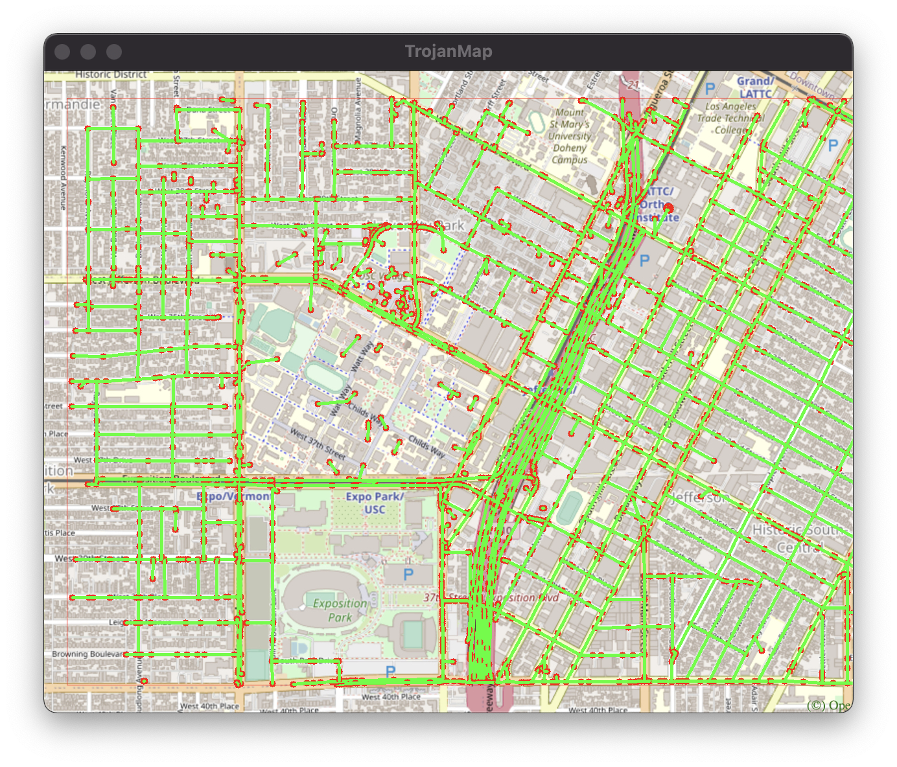

# EE599 Final Project - Spring 2021 - TrojanMap

## TrojanMap

This project focuses on using data structures in C++ and implementing various graph algorithms to build a map application.

<p align="center"></p>

- run main function
  ```
  bazel run src/main:main
  ```

- run trojanmap test function
  ```
  bazel run tests/trojanmap_test
  ```
- run trojanmap test student function 
   ```
   bazel run tests/trojanmap_test_student
   ```
---

## The data Structure

Each point on the map is represented by the class **Node** shown below and defined in [trojanmap.h](src/lib/trojanmap.h).

```cpp
class Node {
  public:
    std::string id;    // A unique id assign to each point
    double lat;        // Latitude
    double lon;        // Longitude
    std::string name;  // Name of the location. E.g. "Bank of America".
    std::vector<std::string>
        neighbors;  // List of the ids of all neighbor points.
};

```
---
## Step 1: Autocomplete the location name

```c++
std::vector<std::string> Autocomplete(std::string name);
```
- user selects item 1 and gives input as the name parameter.
- this function will use ```std::transform(name.begin(), name.end(), name.begin(), ::tolower)``` to convert the name to be lowercase.
-  iterates all nodes in data (map), deep copy the name of each node and use the same method to convert it be lowercase. 
-  Finally, check whether the given name is exactly the prefix of the node name. If it is, add that node name into results vector.


Time complexity: O(n), n is the number of nodes on map. Each node will be checked only once, and the length of node name can be ignored.

Example:

```shell
1
**************************************************************
* 1. Autocomplete                                             
**************************************************************

Please input a partial location:ch
*************************Results******************************
ChickfilA
Chipotle Mexican Grill
**************************************************************
Time taken by function: 447 microseconds
```
```shell
1
**************************************************************
* 1. Autocomplete                                             
**************************************************************

Please input a partial location:ta
*************************Results******************************
Target
Tap Two Blue
**************************************************************
Time taken by function: 754 microseconds
```

## Step 2: Find the place's Coordinates in the Map

```c++
std::pair<double, double> GetPosition(std::string name);
```
- user selects item 2 and gives input as the name parameter.
- the function will check the validity of node name, if it's invalid, just return (-1, -1). 
- call ```Node TrojanMap::GetNode(std::string name)``` to find that node using name by iterating all nodes in map.
- If the node cannot be found, just return (-1, -1), else return (node.lat, node.lon).

Time complexity: O(n), n is the number of nodes on map. This function will call ```Node TrojanMap::GetNode(std::string name)```, in which each node will be checked only once.

Example:
```shell
2
**************************************************************
* 2. Find the position                                        
**************************************************************

Please input a location:ChickfilA
*************************Results******************************
Latitude: 34.0167 Longitude: -118.283
**************************************************************
Time taken by function: 417 microseconds

2
**************************************************************
* 2. Find the position                                        
**************************************************************

Please input a location:Target
*************************Results******************************
Latitude: 34.0257 Longitude: -118.284
**************************************************************
Time taken by function: 459 microseconds
```
<p align="center"></p>

## Step 3: CalculateShortestPath between two places

```c++
std::vector<std::string> CalculateShortestPath_Dijkstra(std::string &location1_name,
                                               std::string &location2_name);
std::vector<std::string> CalculateShortestPath_Bellman_Ford(std::string &location1_name,
                                               std::string &location2_name);
```
- user selects item 3, give the start location name and destination name.
- user selects the id of shortest path algorithm (1 or 2). 
- 1 Dijkstra algorithm:
  - get the start node id and end node id using ```Node TrojanMap::GetNode(std::string name)``` and check their validity. 
  - define ```std::unordered_map<std::string, double> minDist``` where key is the node id, value is minimum distance from that node to start node.
  - define ```std::unordered_map<std::string, std::string> prev``` where key is the current node id, value is the previous node id before reaching current node. 
  - initialize the minDist map by setting all its values to be MAX. iniliaze the prev node ids as "".
  - set the start node distance as 0. initialize ```typedef std::pair<double, std::string> myPair``` where key is the distance from current node to start node, value is current node id. 
  - set ```std::priority_queue<myPair, std::vector<myPair>, std::greater<myPair>> pq``` to keep the myPair order by the distance from current node to start node, add pair(0, start node id) into pq.
  - pop the pair on the top of pq and get current node id. iterate its neighbors to calculate the distance from start node to neighbor node bypassing current node.
  - update the minDist ofneighbor node if the path is improved.
  - if current node id is the destination, just end loop.
  - find all node ids from end node to start node using prev vector, the reverse it as return value.
  
time complexity: O(Vlog(E)), where E is the number of edges, V is the number of nodes.

Example:
```shell
3
**************************************************************
* 3. CalculateShortestPath                                    
**************************************************************

Please input the start location:Ralphs
Please input the destination:ChickfilA
Please select the id of shortest path algorithms:
1 - Dijkstra
2 - Bellman Ford (default)
1
*************************Results******************************
2578244375
5559640911
6787470571
6808093910
6808093913
6808093919
6816831441
6813405269
6816193784
6389467806
6816193783
123178876
2613117895
122719259
2613117861
6817230316
3642819026
6817230310
7811699597
5565967545
123318572
6813405206
6813379482
544672028
21306059
6813379476
6818390140
63068610
6818390143
7434941012
4015423966
5690152766
6813379440
6813379466
21306060
6813379469
6813379427
123005255
6807200376
6807200380
6813379451
6813379463
123327639
6813379460
4141790922
4015423963
1286136447
1286136422
4015423962
6813379494
63068643
6813379496
123241977
4015372479
4015372477
1732243576
6813379548
4015372476
4015372474
4015372468
4015372463
6819179749
1732243544
6813405275
348121996
348121864
6813405280
1472141024
6813411590
216155217
6813411589
1837212103
1837212101
6820935911
4547476733
The distance of the path is:1.53852 miles
**************************************************************
Time taken by function: 29966 microseconds
```

- 2 Bellman Ford (default) algorithm: 
  - get the start node id and end node id using ```Node TrojanMap::GetNode(std::string name)```, then check their validity. 
  - define ```std::unordered_map<std::string, double> minDist``` where key is the node id, value is minimum distance from that node to start node.
  - define ```std::unordered_map<std::string, std::string> prev``` where key is the current node id, value is the previous node id before reaching current node. 
  - initialize the minDist map by setting all values to be MAX. iniliaze the prev node ids of each node as "".
  - set the start node distance as 0. define and initialize the ```std::vector<std::vector<std::string>> edges``` where all edges will be added into this vector.
  - use one loop to set the minDist of each node, use another loop to iterate each edge, then calculate the distance from current node to next node, update the minDist of next node if the path length bypassing current node is improved.
  - if no improvement after iterating all edges, just break loop.
  - find all node ids from end node to start node using prev vector, the reverse it as return value.
  
time complexity: O(V * E), where E is the number of edges, V is the number of nodes.

Example:
```
3
**************************************************************
* 3. CalculateShortestPath                                    
**************************************************************

Please input the start location:Ralphs
Please input the destination:ChickfilA
Please select the id of shortest path algorithms:
1 - Dijkstra
2 - Bellman Ford (default)
2
*************************Results******************************
2578244375
5559640911
6787470571
6808093910
6808093913
6808093919
6816831441
6813405269
6816193784
6389467806
6816193783
123178876
2613117895
122719259
2613117861
6817230316
3642819026
6817230310
7811699597
5565967545
123318572
6813405206
6813379482
544672028
21306059
6813379476
6818390140
63068610
6818390143
7434941012
4015423966
5690152766
6813379440
6813379466
21306060
6813379469
6813379427
123005255
6807200376
6807200380
6813379451
6813379463
123327639
6813379460
4141790922
4015423963
1286136447
1286136422
4015423962
6813379494
63068643
6813379496
123241977
4015372479
4015372477
1732243576
6813379548
4015372476
4015372474
4015372468
4015372463
6819179749
1732243544
6813405275
348121996
348121864
6813405280
1472141024
6813411590
216155217
6813411589
1837212103
1837212101
6820935911
4547476733
The distance of the path is:1.53852 miles
**************************************************************
Time taken by function: 1918954 microseconds
```

<p align="center"></p>

## Step 4: The Travelling Trojan Problem (AKA Traveling Salesman!)
- user selects item 4, give the number of nodes "n" the subgraph will has.
- this function randomly select "n" nodes on the graph.
- user select the id of TSP algorithms
   - 1 Brute Force:
     - The function ```std::pair<double, std::vector<std::vector<std::string>>> TravellingTrojan(
      std::vector<std::string> &location_ids)``` will be called.
     - just like solving permutation problems using dfs, this function keep the first node as start node, change the order of other nodes to get all possible routes.
     - compare with the optimal one once a possible route is generated, and update it if current route has less total distance.

Time complexity: O(n!), n is the number of nodes specified by user.

Example:
```shell
4
**************************************************************
* 4. Travelling salesman problem                              
**************************************************************

In this task, we will select N random points on the map and you need to find the path to travel these points and back to the start point.

Please input the number of the places:7
Please select the id of TSP algorithms:
1 - Brute Force
2 - 2-opt Heuristic (default)
1
Calculating ...

*************************Results******************************
4015372461
269635101
3574052741
2193435018
7863656075
6807438997
544671962
4015372461
**************************************************************
The distance of the path is:3.96236 miles
**************************************************************
You could find your animation at src/lib/output.avi.          
Time taken by function: 21823 microseconds
```

   - 2 2-opt Heuristic (default):
     - The function ```std::pair<double, std::vector<std::vector<std::string>>> TrojanMap::TravellingTrojan_2opt(
      std::vector<std::string> &location_ids)``` will be called.
     - use location_ids as current route, calculate its total distance.
     - ```shell{
         start_again:
         for (i = 1; i <= number of nodes eligible to be swapped - 1; i++) {
            for (k = i + 1; k <= number of nodes eligible to be swapped; k++) {
                  new_route = 2optSwap(existing_route, i, k)
                  new_distance = calculateTotalDistance(new_route)
                  if (new_distance < best_distance) {
                     existing_route = new_route
                     best_distance = new_distance
                     goto start_again
                  }
            }
         }
      ```
     
   - after getting the best distance and best route, generate the progress traces, return that traces.

Time complexity: unknown because this is a heuristic optimized algorithm, will get different approximate solutions after each running.

Example:
```shell
4
**************************************************************
* 4. Travelling salesman problem                              
**************************************************************

In this task, we will select N random points on the map and you need to find the path to travel these points and back to the start point.

Please input the number of the places:7
Please select the id of TSP algorithms:
1 - Brute Force
2 - 2-opt Heuristic (default)
2
Calculating ...

*************************Results******************************
4011837221
4015486537
1732340067
2613117914
6512317622
6814620863
269633281
4011837221
**************************************************************
The distance of the path is:5.41129 miles
**************************************************************
You could find your animation at src/lib/output.avi.          
Time taken by function: 1530 microseconds
```

## Step 5: Cycle Detection

```c++
bool CycleDetection(std::vector<double> &square);
```
- user selects item 5, gives the left/right longitude and up/bottom latitude as input.
- This function will check the validity of square, if it's invalid just return false.
- iterate all nodes on map to find all nodes(ids) in the square.
- define ```std::unordered_map<std::string, int> visited``` to mark node id: 
  - 0: unvisited; 
  - 1: being visited; 
  - 2 has been visited;
- define ```std::unordered_map<std::string, std::string> prev``` where key is current node id, value is previous node id before reaching current node.
- define ```std::vector<std::string> cycle``` to find one cycle in graph.
- initialize visited vector by marking all nodes as 0 and all values of prev map as "".
- iterate each id in ids vector(in square), if it's marked as 0 (unvisited), then do dfs starting from that id.
  - in dfs, mark current id as 1 (being visited), then iterate its neighbor ids. 
     - if the neighbor id is in visited set (in square) 
       - if next neighbor id marked as 0 (not visited)
         - just call dfs again on that neighbor id. 
       - if next neighbor id marked as 1 (being visited) and it's not the previous node of current node
         - cycle found, find all node ids in prev vector starting from current node id, end at neighbor node id, add into cycle vector.
- mark current node (id) as 2 (has been visited)

Time complexity: O(n), n is the number of nodes in square. In worse case, all nodes in square will be visited (marked 2) once.

Example 1:
```shell
5
**************************************************************
* 5. Cycle Detection                                          
**************************************************************

Please input the left bound longitude(between -118.299 and -118.264):-118.299
Please input the right bound longitude(between -118.299 and -118.264):-118.264
Please input the upper bound latitude(between 34.011 and 34.032):34.032
Please input the lower bound latitude(between 34.011 and 34.032):34.011
*************************Results******************************
there exists cycle in the subgraph 
**************************************************************
Time taken by function: 71510 microseconds
```
<p align="center"></p>

Example 2:
```shell
5
**************************************************************
* 5. Cycle Detection                                          
**************************************************************

Please input the left bound longitude(between -118.299 and -118.264):-118.290919
Please input the right bound longitude(between -118.299 and -118.264):-118.282911
Please input the upper bound latitude(between 34.011 and 34.032):34.02235
Please input the lower bound latitude(between 34.011 and 34.032):34.019675
*************************Results******************************
there exist no cycle in the subgraph 
**************************************************************
Time taken by function: 2353 microseconds
```
<p align="center"></p>

## Step 6: Topological Sort

```c++
std::vector<std::string> DeliveringTrojan(std::vector<std::string> &location_names,
                                            std::vector<std::vector<std::string>> &dependencies);
```
- user selects item 6, gives the csv files absolute path as input (read locations and dependencies from given csv files path or use default files path using ```std::vector<std::string> TrojanMap::ReadLocationsFromCSVFile(std::string locations_filename)``` and ```std::vector<std::vector<std::string>> TrojanMap::ReadDependenciesFromCSVFile(std::string dependencies_filename)```). - the generated locations vector and dependencies vector will be used as parameters in ```std::vector<std::string> TrojanMap::DeliveringTrojan(std::vector<std::string> &locations, std::vector<std::vector<std::string>> &dependencies)```. 
- In this function, check the validity of locations vector and dependencies vector. If invalid just return empty vector.
- define and initialize directed graph using ```std::unordered_map<std::string, std::unordered_set<std::string>> graph``` (adjacency list representation).
- define and initialize ```std::unordered_map<std::string, int> indegree``` to calculate the indegree of each node in graph by iterating all edges.
- find all locations whose indegree is 0, push them into queue as start nodes of Topological Sorting.
- pop node (id) from queue, add it into results. then iterate its neighbors (ids) to reduce the indegree by 1. If the indegree is 0, then push that node id into queue as start node. 
- Repeat until queue is empty, if the size of results vector == the size of locations, then all nodes can be visited, else cycle exists.

time complexity: O(V + E), where E is the number of edges, V is the number of nodes in directed graph.


Example:
```shell
6
**************************************************************
* 6. Topological Sort                                         
**************************************************************

Please input the locations filename:/Users/max/Desktop/USC/EE599_C++/Final-Project/final-project-gpldirk/input/topologicalsort_locations.csv
Please input the dependencies filename:/Users/max/Desktop/USC/EE599_C++/Final-Project/final-project-gpldirk/input/topologicalsort_dependencies.csv
*************************Results******************************
Topological Sorting Reults:
Cardinal Gardens
Coffee Bean1
CVS
**************************************************************
Time taken by function: 443260 microseconds
```
<p align="center"></p>

